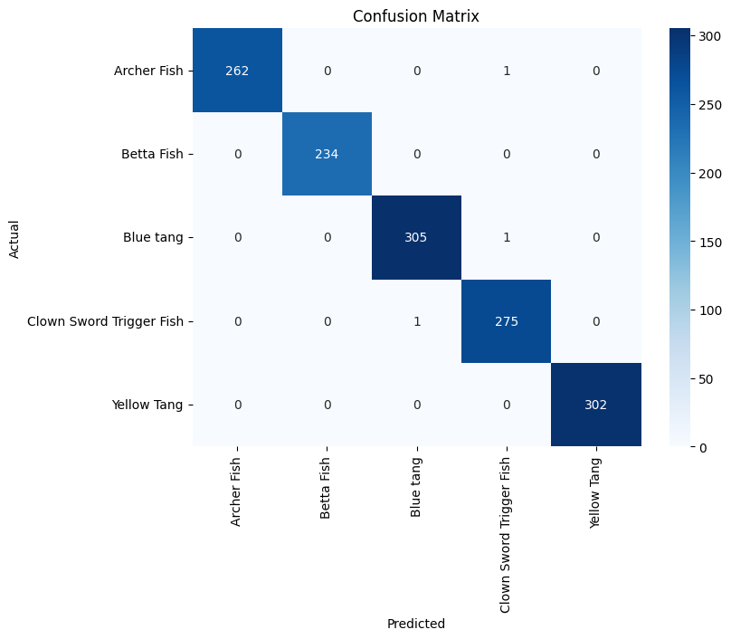
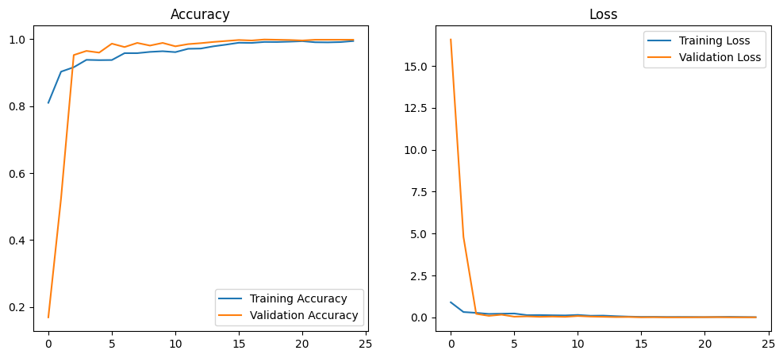
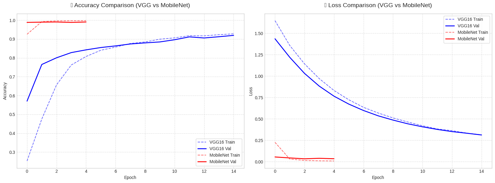
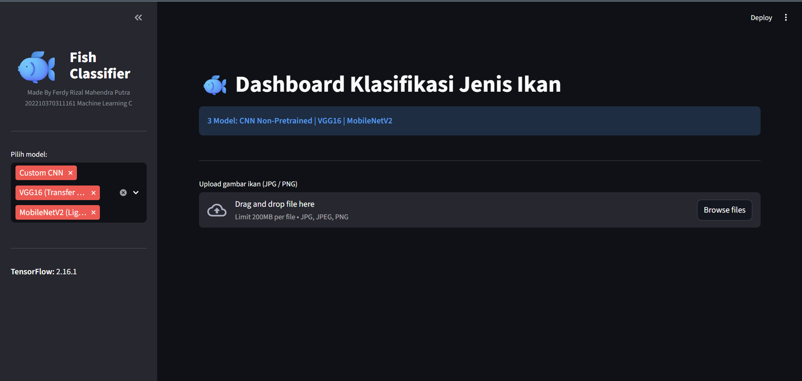
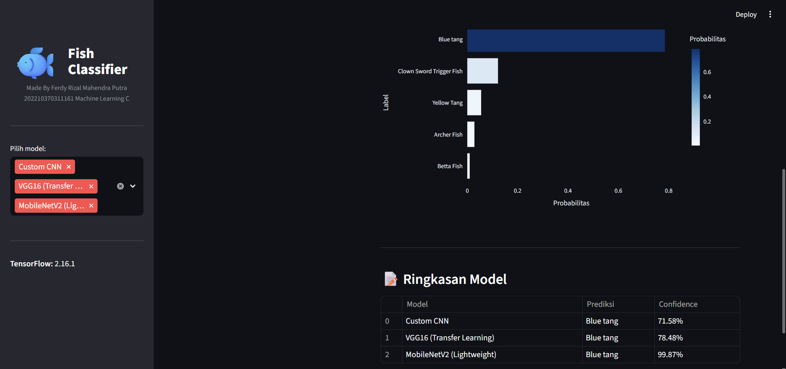

<div align="center">

# 🐟 Fish Classifier Pro
### Dashboard Analisis Klasifikasi Citra Ikan (UAP Machine Learning)


<br>

<p align="center">
  <b>Klasifikasi Ikan End-to-End dengan Perbandingan 3 Model Deep Learning</b><br>
  Custom CNN | VGG16 | MobileNetV2
</p>

</div>

---

## 📝 Deskripsi Proyek
**Fish Classifier Pro** adalah sistem klasifikasi citra berbasis *Deep Learning* yang dikembangkan untuk memenuhi **Ujian Akhir Praktikum (UAP) Pembelajaran Mesin**. Proyek ini bertujuan untuk mengklasifikasikan 5 jenis ikan secara otomatis menggunakan antarmuka web interaktif berbasis Streamlit.

Sistem ini membandingkan performa antara model yang dibangun dari awal (*Custom CNN*) dengan model *Transfer Learning* (*VGG16* dan *MobileNetV2*) untuk menganalisis efektivitas arsitektur terhadap dataset ikan.

---

## 📊 Dataset dan Preprocessing
Dataset yang digunakan bersumber dari Kaggle: **[My Fish Dataset](https://www.kaggle.com/datasets/srajangoyal1808/my-fish-dataset)**.

* **Jumlah Data:** > 5.000 citra (termasuk augmentasi).
* **Kelas (Label):**
    1.  `Archer Fish` (Ikan Pemanah)
    2.  `Betta Fish` (Ikan Cupang)
    3.  `Blue Tang` (Dory)
    4.  `Clown Sword Trigger Fish`
    5.  `Yellow Tang`
* **Preprocessing:**
    * **Resizing:** Citra diubah menjadi **128x128 pixel**.
    * **Augmentation:** Rotasi, Zoom, dan Flip untuk variasi data latih.
    * **Normalization:** Pixel dinormalisasi ke rentang 0-1.

---

## 🧠 Model yang Digunakan
Sesuai ketentuan UAP, proyek ini mengimplementasikan 3 model untuk perbandingan:

| Tipe Model | Nama Model | Deskripsi |
| :--- | :--- | :--- |
| **Non-Pretrained** | **Custom CNN** | Arsitektur CNN sederhana yang dibangun *from scratch* (Conv2D, MaxPooling, Dropout). |
| **Transfer Learning** | **VGG16** | Model *State-of-the-art* dengan bobot ImageNet. Layer atas di-*freeze*. |
| **Transfer Learning** | **MobileNetV2** | Model ringan (*lightweight*) yang efisien, cepat, dan akurat untuk deployment web. |

---

## 📈 Hasil Evaluasi dan Analisis Perbandingan
Berikut adalah tabel perbandingan performa ketiga model berdasarkan pengujian pada data test:

| Nama Model | Akurasi | Precision | Recall | Hasil Analisis |
| :--- | :---: | :---: | :---: | :--- |
| **Custom CNN** | **1.00** | 1.00 | 1.00 | Sangat akurat pada data uji, namun terindikasi **Overfitting**. Saat dicoba prediksi gambar dari internet, terkadang salah (khususnya *Betta Fish*). |
| **MobileNetV2** | **0.97** | 0.97 | 0.97 | **Model Terbaik.** Memberikan keseimbangan performa dan kecepatan. Generalisasi sangat baik pada data baru/asing. |
| **VGG16** | **0.92** | 0.92 | 0.92 | Akurasi terendah. Model ini sangat kompleks (berat) dan mungkin memerlukan *fine-tuning* lebih mendalam untuk dataset yang spesifik ini. |

> **Kesimpulan:** Untuk implementasi aplikasi nyata, **MobileNetV2** dipilih karena ukurannya kecil (<20MB) dan akurasinya stabil di 97%.

### 🖼️ Visualisasi Performa
Berikut adalah bukti visualisasi hasil pelatihan (Confusion Matrix & Grafik Loss).

**1. Analisis Custom CNN**
| Confusion Matrix | Grafik Training |
| :---: | :---: |
|  |  |

**2. Analisis Model Pretrained (VGG16 & MobileNetV2)**
| Perbandingan Matrix | Perbandingan Grafik |
| :---: | :---: |
|  |  |

---

## 💻 Tampilan Aplikasi
Aplikasi dibangun menggunakan **Streamlit**. Berikut adalah antarmuka saat melakukan prediksi multi-model:
Kamu akan diarahkan ke halaman ini untuk melakukan pengklasifikasian jenis ikan, dimana kamu dalam sekali input bisa memilih 3 model sekaligus dan pilih 1 per 1.





## 💻 Struktur Kode VSCODE
Tampilan Struktur isi **VSCODE**. Berikut adalah antarmuka saat melakukan prediksi multi-model:


---

## 💾 Unduh Model (Wajib)
Dikarenakan ukuran file yang besar, model **TIDAK** disertakan dalam repository ini. Anda wajib mengunduhnya dari Google Drive agar aplikasi dapat berjalan.

👉 **[Klik Disini untuk Mengunduh Model (Google Drive)](https://drive.google.com/drive/folders/1NfR57UOqIpU_pH_aJgAUqQmrrebWhvXB?usp=sharing)**

**Panduan Penempatan File:**
1. Unduh kedua folder: `Model_Final` dan `Model_pre-trained`.
2. Letakkan kedua folder tersebut di direktori utama proyek (sejajar dengan `app.py`).

Struktur akhir folder Anda harus terlihat seperti ini:

## 📂 Struktur Folder Proyek
Struktur direktori repository ini disusun sesuai standar pengumpulan:

```text
UAP_MachineLearning_161/
│
├── app.py                    # File utama aplikasi
├── Model_Final/              # 📂 Folder dari Google Drive
│   ├── fish_classifier_final.h5
│   └── fish_labels_final.json
│
├── Model_pre-trained/        # 📂 Folder dari Google Drive
│   ├── VGG16_fast_best_FIXED.keras
│   ├── MobileNetV2_fast_best_FIXED.keras
│   └── class_names.pkl
│
├── Assets/                   # Folder gambar dokumentasi
├── notebooks/                # Folder notebook
└── requirements.txt
```

## 🛠️ Panduan Menjalankan Sistem (Lokal)

Ikuti langkah-langkah berikut untuk menjalankan aplikasi di komputer Anda.

### 1️. Clone Repository, Instalasi Dependensi, dan Menjalankan Aplikasi

Buka terminal / Command Prompt, lalu jalankan perintah berikut secara berurutan:

# Clone repository dan masuk ke direktori proyek
```text
git clone https://github.com/Frizal14/UAP_MachineLearning_161.git && cd UAP_MachineLearning_161
```

# Instal seluruh dependensi
```text
pip install -r requirements.txt
```

# Jika terjadi error kompatibilitas library (opsional)
```text
pip install tensorflow==2.16.1 streamlit pillow numpy pandas plotly
```
# Jalankan aplikasi Streamlit
```text
streamlit run app.py
```

Aplikasi akan otomatis terbuka di browser Anda pada alamat http://localhost:8501.

## 💡 Tips Pengguna Google Colab: File notebook pelatihan model (notebooks/UAP_ML_C_2022_161.ipynb) dapat langsung dijalankan di Google Colab jika Anda memiliki keterbatasan spesifikasi perangkat keras (GPU). Cukup unggah file tersebut ke Colab, namun pastikan Anda menyesuaikan kembali path (lokasi folder) dataset dan penyimpanan model di dalam kode agar sesuai dengan struktur direktori Google Drive Anda, karena konfigurasi path saat ini disesuaikan untuk lingkungan lokal (VS Code), dan sebaiknya pakai GPU T4 Google colab jika agar lebih lancar.

## 👨‍💻 Identitas Pengembang
Proyek ini dibuat sebagai syarat kelulusan praktikum.

Nama: Ferdy Rizal Mahendra Putra

NIM: 202210370311161

Kelas: Machine Learning C

Program Studi: Informatika

Universitas: Universitas Muhammadiyah Malang
